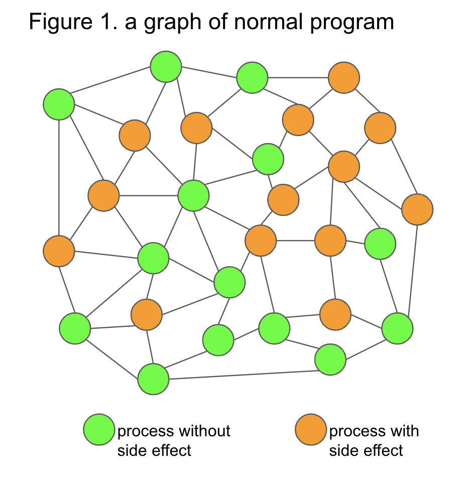
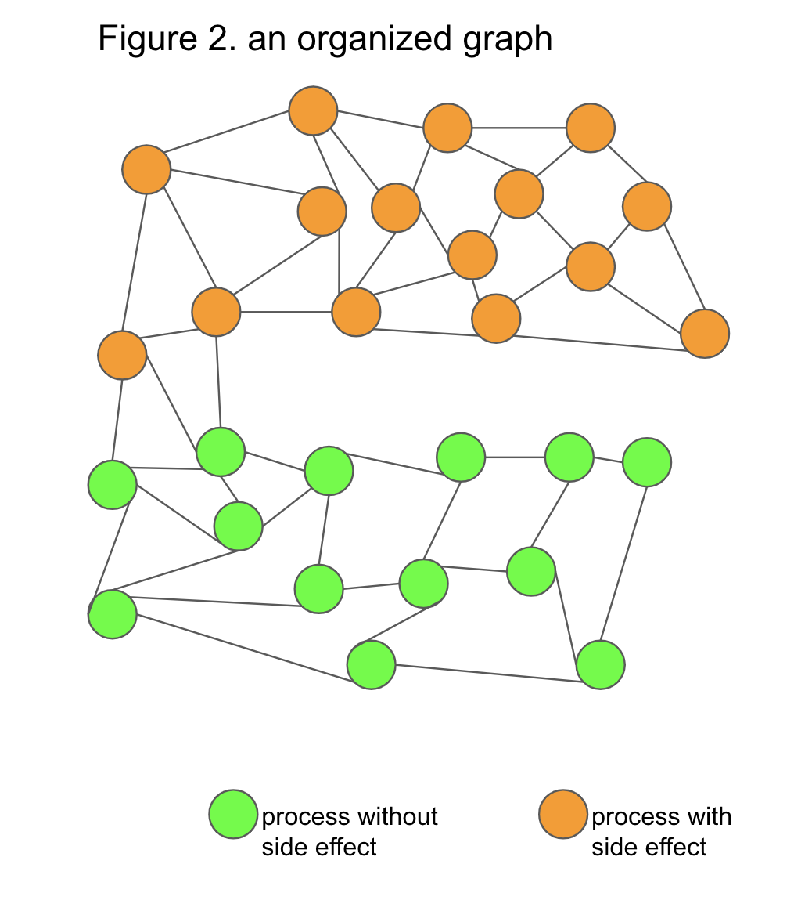
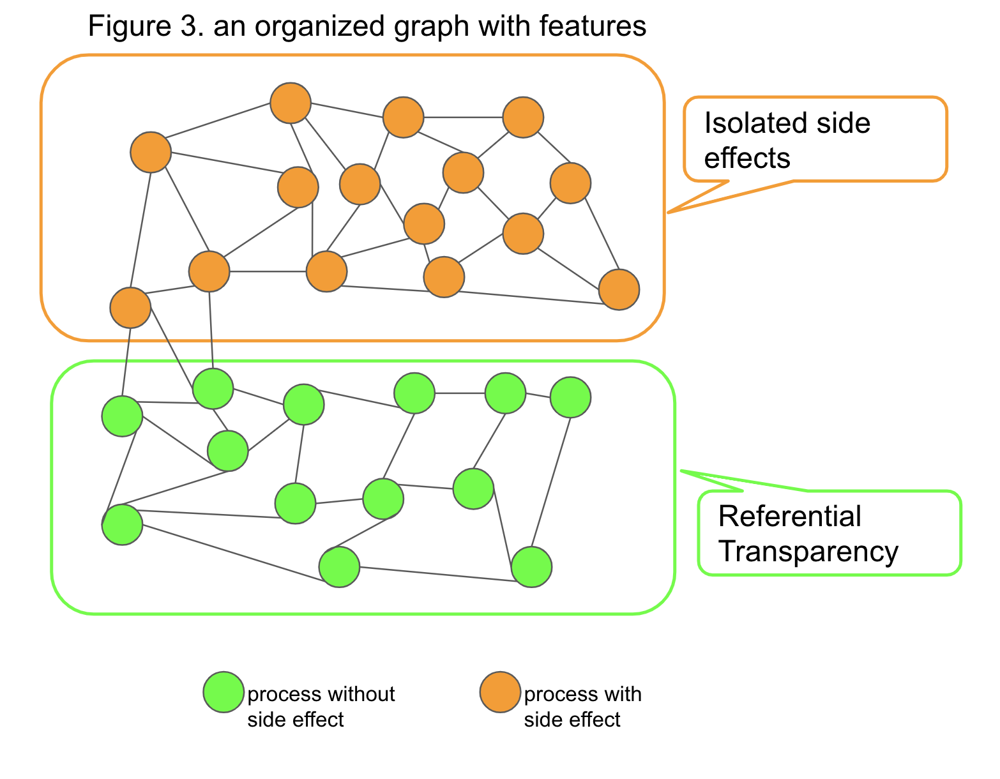
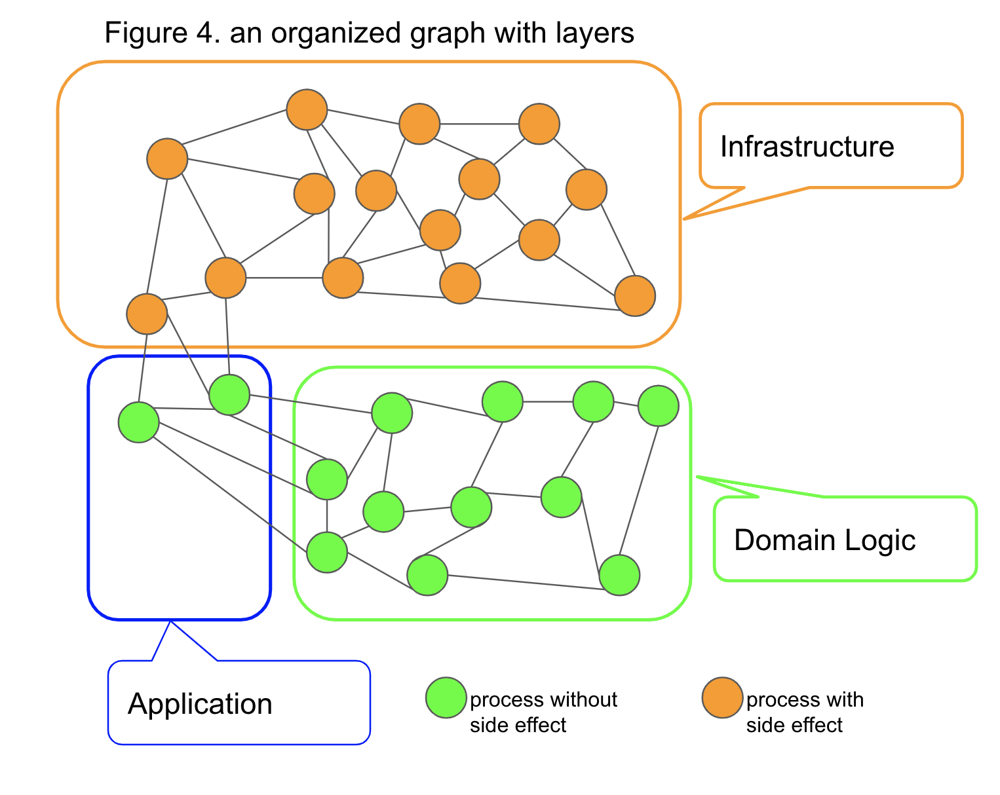
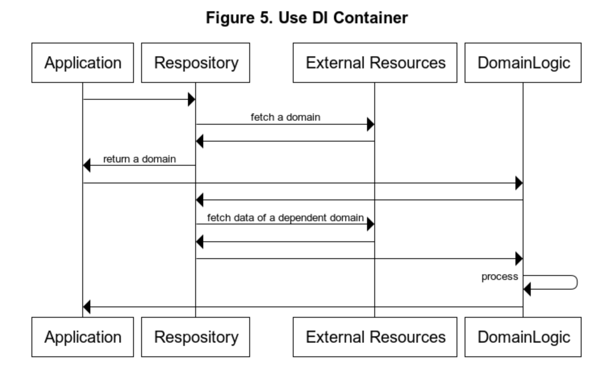
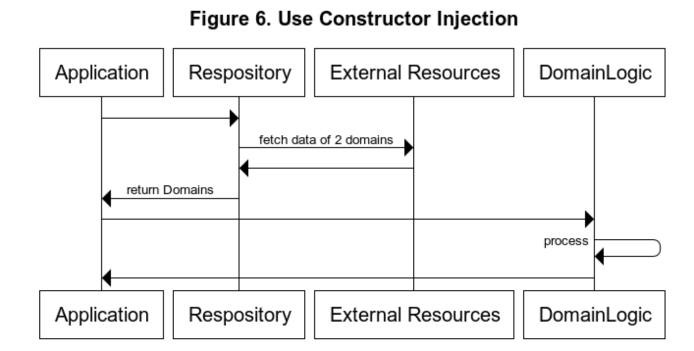
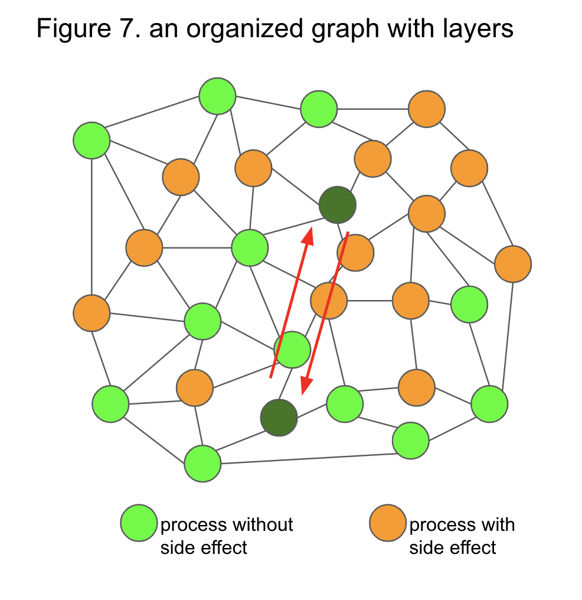
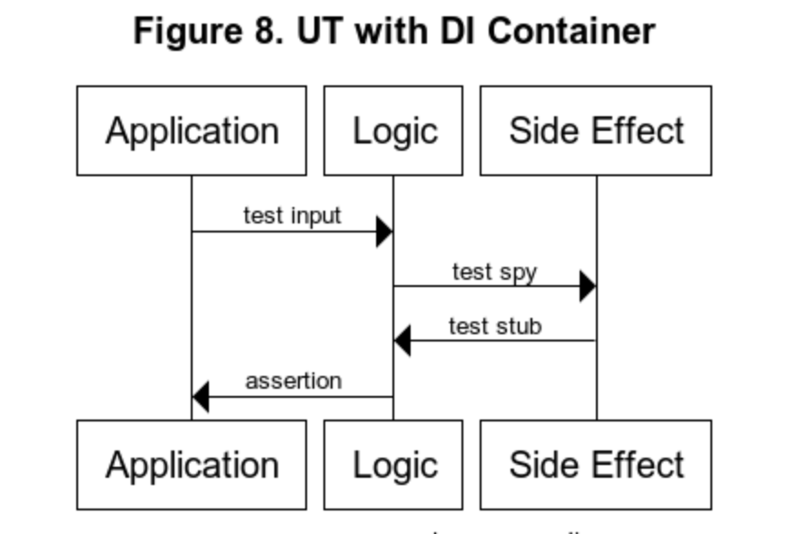
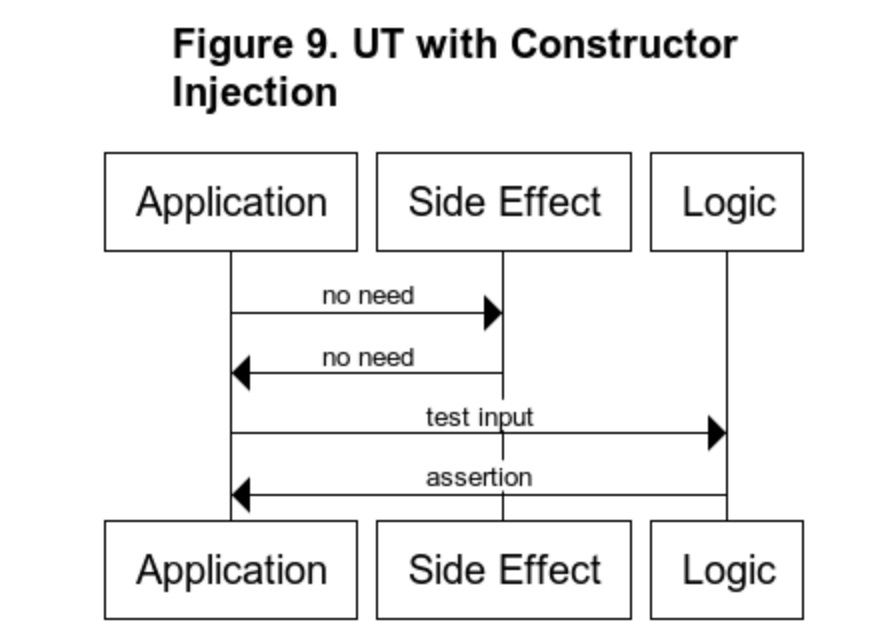
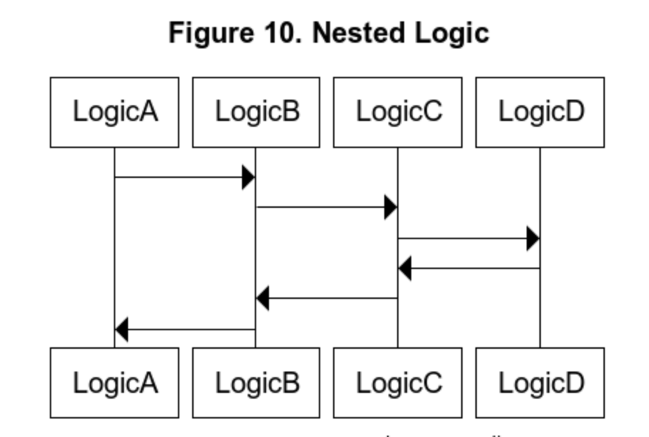

I have been applying Hexagonal Architecture and The Clean Architecture to my work for the past few years. Over time, I found a pattern that produced some significant effects that were not present in the original ones. I called it a kind of clean architecture for a while, but since the differences have become so large that it's hard to communicate verbally easily, I decided to give it a name and explain it.

This architecture can coexist with its two predecessor architectures, and its features can be obtained intact with the following new benefits.

1. There is a nudge to induce emergent design and promote design improvement.
1. Increasing the testability of Domain Logic
1. Increase the ease of change

In the following text, I will first tell you the concept of this architecture, show you how to construct it, and explain how the benefits occur.

### The Concept of The Origami Architecture

We can grasp every program as a three-dimensional graph structure with processes as nodes. Architecture is a pattern of it. In the system, processes, which are nodes, can be organized in appropriate positions according to their properties. A similar example is the structure of a protein composed of several elements.

Unfortunately, the diagrams I'm going to use to explain this is a two-dimensional figure, but I'd like you to imagine it as a three-dimensional figure if possible.

Figure 1 is an ordinary program with side effects scattered throughout the graph. Think of these side effects as access to external resources. The side-effects are often dependent on the abstraction using Dependency Injection to isolate the implementation, and we can replace them. But there is no referencial transparency here.

So, we widen the area that guarantees referencial transparency as much as possible. We divide it into two parts: one describing with side-effects and the other reference-transparent. And we minimize junctions between reference-transparent and non-reference-transparent regions. (Figure 2)

The part that does not have referencial transparency is the infrastructure layer in Hexagonal Architecture or The Clean Architecture. The area where there is referencial transparency goes to the domain layer. (Figure 3)

The junction is the Application layer, and the infrastructure-independent reference transparent part is the domain logic. (Figure 4)

### How to Construct

Since the essential parts are the same as those of hexagonal and clean architectures, the following two points are crucial. To make domains cleaner to separate it from external dependencies. Applications are available from various UIs, and we can also switch external resources.

The two architectures above do not mention that we should or should not use DI for layer separation. In the Clean Architecture book, you can find some diagrams that seem to assume DI's use. In the Java and Scala Japanese communities around me, DI appears to be the most common way to separate layers. However, there are some problems with it. The first is the loss of referencial transparency. Second is that it reduces testability. Third, the dependencies are separated at compile time but dependent at run time. Fourth, even if the implementation is separated, the concepts and types represented by the model are tightly coupled and not loosely coupled. To avoid these problems, I use constructor injection instead of DI Container. Then, by using constructor injection without DI, domains gain the property of referencial transparency.

Figure 5 and 6 shows the difference between the case of using DI Container and the case of using constructor injection in a sequence diagram.

#### Application Layer

The Application layer is the boundary between the side-effects and the non-side-effects part. The Application layer does not do any processing with side effects, but it loses referencial transparency because of side-effects called in the infrastructure layer. I prefer to manage concurrency and transactions here.

#### Domain Layer

Domains must have referencial transparency properties. Plain Old Objects pattern is also good. To ensure the elimination of external dependencies, you can restrict the direction of dependencies by dividing the project. Separating the application layer and the infrastructure layer is fine if there is a rational reason to do so, but I don't feel much need to do so.

#### Usecase
The application layer of Hexagonal Architecture and the use case layer of The Clean Architecture are in a similar position, but I think they are two different things. The application belongs to the infrastructure layer, and the use cases belong to the domain layer.

### How the Benefits Occur
#### How to generate nudges that improve the design

It mainly appears in the application layer. In fetching all the data and generating the domain objects, code smells of Data Clumps (Martin Fowler's Refactoring)  appear when the model is not mature enough. Refactoring them, models mature. It is usually tough to find such a connection, even if there are two positively related and frequently used models in two parts of the graph at the same time (Figure 7). 

However, organizing the side-effects into a bent structure, data clumps are formed when the dependent data passes through the bent part (the Application layer). The pattern of appearance of data clumps becomes a signal to improve models. This effect automatically works if we refactor normally without enforcing coding rules, reviews checklists, etc.

Of course, the refactoring alone does not complete a great model, and to mature the model, it needs to be repeatedly analyzed, abstracted, and reconfigured. But code smells are clear signals of the need for redesign and a trigger to begin to consider redesigning. Although it has been said for many years that repeated analysis and refactoring is an integral part of creating good software, only few organizations are able to do so. Because most of them don't have enough resources to find out what to improve and when to do it. If improvement is not part of the business process, even if individual developers find improvement points, they will be put on the back burner and forgotten in the priority of other projects. Therefore, triggers must occur continuously in a specific place, and if they are known, we should incorporate them into the process.

This effect of The Origami Architecture is a concrete and reproducible method of emergent design that is often mentioned in agile development.

#### Relationship of DI and testability

I will explain the difference between using DI and using constructor injection for unit tests. In unit testing, we typically pass input data to the Logic to be tested and assert the output; if we use DI and there is no referencial transparency, we must also handle test spies and test stubs (Figure 8). In real-world development, we often spent most of the testing effort creating test spies and test stubs using mock libraries.

We no longer need to use test spies and test stubs because we used constructor injection. (Figure 9)

Generally speaking, unit tests are more effective and easier to maintain when you have meaningful, granular, and MECE test cases. When you have nested logics, as in Figure 10, referencial transparency gives you the freedom to choose where to create your tests without worrying about the efforts increasing.

In a program with mixed side effects, test spies and test stubs change with each other as you change the test position, and the effort to deal with mock libraries increases significantly. Therefore, such tests are left unmaintained properly and doomed to become technical debts.

Programs with referencial transparency are also suitable for testing with random data. We can also use the technique to test refactored programs using outputs of executed programs before the change with random data at the time of refactoring.

#### Increase the ease of change

As a detailed design document, all inputs and outputs and the name of the primary process are exposed at the application layer, making it easier to capture an overview of the process when reading the code for changes or modifications.

A graph structure with mixed side effects is difficult to detect even if the call path is complected.
Domains are generated by constructor injection, which affects eliminating complects and keeping the call hierarchy small. Therefore we can reduce the time it takes to read the source code and get to the destination.

If the concurrency in a program is scattered across several locations, it is difficult to manage the overall execution efficiency and resource efficiency. The Origami Architecture practically eliminates the need for concurrency outside of the application layer, making the concurrency naturally clustered in the application layer and more comfortable to control. Changes that are more likely to have a performance impact, such as additional access to external resources, are naturally more likely to appear at the application layer. Even if they don't appear at the application layer, they appear in a shallow place. We can detect it during normal development activities, such as coding or coding reviews. Likewise, we can quickly identify a cause when any unexpected performance incidents occur.

### Conclusion

I named The Origami Architecture from the idea of viewing a program as a three-dimensional graph structure and fold it. I believe that this method has the potential to be used by many people because it can create a significant effect with small rules, is not dependent on a language or framework, and can be used in parts. I will be pleased if this blog post has helped someone, even in part. Please feel free to give me feedback if you feel any way about it.